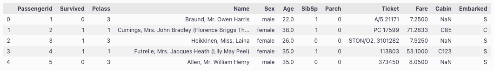

# PandasDataFrameOutputParser


이 가이드에서는 LangChain의 PandasDataFrameOutputParser에 대해 설명합니다. PandasDataFrameOutputParser는 LLM(Large Language Model)의 출력을 파싱하여 Pandas DataFrame으로 변환하는 데 사용됩니다. 이를 통해 LLM의 출력을 데이터 분석 및 조작에 활용할 수 있습니다.


### 설치

가이드를 시작하기 전에 필요한 라이브러리를 설치합니다.

```python
import pprint
from typing import Any, Dict

import pandas as pd
from langchain.output_parsers import PandasDataFrameOutputParser  
from langchain.prompts import PromptTemplate  

from langchain_community.chat_models import BedrockChat

llm = BedrockChat(
    model_id="anthropic.claude-3-haiku-20240307-v1:0", region_name="us-east-1"
)
```

* `pandas`: 데이터 분석 및 조작을 위한 라이브러리입니다.
* `PandasDataFrameOutputParser`: LLM의 출력을 Pandas DataFrame으로 파싱하는 모듈입니다.
* `PromptTemplate`: LLM에 전달할 프롬프트 템플릿을 생성하는 모듈입니다.
* `BedrockChat`: Anthropic의 ChatGPT API를 사용하기 위한 LangChain 모듈입니다.

### 파서 출력 형식 지정 함수

파서의 출력을 예쁘게 출력하기 위한 함수를 정의합니다.

```python
def format_parser_output(parser_output: Dict[str, Any]) -> None:
    for key in parser_output.keys():  # 파서 출력의 키들을 순회합니다.
        # 각 키의 값을 딕셔너리로 변환합니다.
        parser_output[key] = parser_output[key].to_dict() 
    # 예쁘게 출력합니다.
    return pprint.PrettyPrinter(width=4, compact=True).pprint(parser_output)
```

### DataFrame 생성

Pandas DataFrame을 생성합니다. 여기서는 예시로 Titanic 데이터셋을 사용합니다.\




```python
df = pd.read_csv("titanic.csv")
df.head()
```

<figure><figcaption></figcaption></figure>

### PandasDataFrameOutputParser 초기화

`PandasDataFrameOutputParser`를 초기화할 때 `dataframe` 인자에 생성한 DataFrame을 전달합니다.

```python
parser = PandasDataFrameOutputParser(dataframe=df)
```

### 열 작업 예시

DataFrame의 특정 열을 추출하는 예시입니다.

```python
df_query = "Retrieve the passengers ages."

prompt = PromptTemplate(
    template="Answer the user query.\n{format_instructions}\n{query}\n",
    input_variables=["query"],
    partial_variables={
        "format_instructions": parser.get_format_instructions()
    },
)

chain = prompt | llm | parser
parser_output = chain.invoke({"query": df_query})

format_parser_output(parser_output)
```



{'Age': {0: 22.0, 1: 38.0, 2: 26.0, 3: 35.0, 4: 35.0, 5: nan, 6: 54.0, 7: 2.0, 8: 27.0, 9: 14.0, 10: 4.0, 11: 58.0, 12: 20.0, 13: 39.0, 14: 14.0, 15: 55.0, 16: 2.0, 17: nan, 18: 31.0, 19: nan\}}



* `df_query`에는 수행할 작업을 설명하는 문자열을 지정합니다.
* `PromptTemplate`을 사용하여 프롬프트 템플릿을 생성합니다.
* `chain`을 생성하고 `invoke` 메서드를 사용하여 체인을 실행합니다.
* `format_parser_output` 함수를 사용하여 파서 출력을 예쁘게 출력합니다.

### 행 작업 예시

DataFrame의 특정 행을 추출하는 예시입니다.

```python
df_query = "Retrieve the first row."

prompt = PromptTemplate(
    template="Answer the user query.\n{format_instructions}\n{query}\n",
    input_variables=["query"],
    partial_variables={
        "format_instructions": parser.get_format_instructions()
    },
)

chain = prompt | llm | parser
parser_output = chain.invoke({"query": df_query})

format_parser_output(parser_output)
```



{'0': {'Age': 22.0, 'Cabin': nan, 'Embarked': 'S', 'Fare': 7.25, 'Name': 'Braund, ' 'Mr. ' 'Owen ' 'Harris', 'Parch': 0, 'PassengerId': 1, 'Pclass': 3, 'Sex': 'male', 'SibSp': 1, 'Survived': 0, 'Ticket': 'A/5 ' '21171'\}}



* `df_query`에는 수행할 작업을 설명하는 문자열을 지정합니다.
* `PromptTemplate`을 사용하여 프롬프트 템플릿을 생성합니다.
* `chain`을 생성하고 `invoke` 메서드를 사용하여 체인을 실행합니다.
* `format_parser_output` 함수를 사용하여 파서 출력을 예쁘게 출력합니다.

### 임의의 DataFrame 작업 예시

DataFrame에 대한 임의의 작업을 수행하는 예시입니다. 여기서는 특정 행 범위의 평균 나이를 계산합니다.

```python
df_query = "Retrieve the average of the ages from row 0 to 4."

prompt = PromptTemplate(
    template="Answer the user query.\n{format_instructions}\n{query}\n",
    input_variables=["query"],
    partial_variables={
        "format_instructions": parser.get_format_instructions()
    },
)

chain = prompt | llm | parser
parser_output = chain.invoke({"query": df_query})

print(parser_output)
```



{'mean': 31.2}



* `df_query`에는 수행할 작업을 설명하는 문자열을 지정합니다.
* `PromptTemplate`을 사용하여 프롬프트 템플릿을 생성합니다.
* `chain`을 생성하고 `invoke` 메서드를 사용하여 체인을 실행합니다.
* `print` 함수를 사용하여 결과를 출력합니다.

PandasDataFrameOutputParser를 활용하면 LLM의 출력을 Pandas DataFrame으로 변환하여 데이터 분석 및 조작에 활용할 수 있습니다. 이를 통해 LLM을 데이터 분석 작업에 통합하고, 보다 풍부한 정보를 추출할 수 있습니다.
